# Datenbankschema

Stand: Migration `0032`. Die Spaltenlisten unten sind aus den SQLAlchemy-Modellen erzeugt (`Base.metadata` aller `models.py`-Dateien plus `core/audit.py`). Das sind dieselben Module, die `backend/alembic/env.py` importiert. Insgesamt gibt es 61 Tabellen.

- **Produktion:** PostgreSQL 16. Das Schema entsteht ausschließlich über Alembic (`backend/alembic/versions/0001`–`0032`). `scripts/migrate-then-start.sh` führt `alembic upgrade head` vor dem Start des Backends aus.
- **Tests:** SQLite in-memory über `Base.metadata.create_all`, einmal pro Testprozess; jeder Test wird per SAVEPOINT-Rollback isoliert (`backend/tests/conftest.py`). Die Migrationen laufen in der CI zusätzlich gegen PostgreSQL.
- **IDs:** fast überall `VARCHAR(36)` mit UUID-Text; Ausnahme `audit_logs.id` (Integer, autoincrement).
- **JSON-Spalten** (`JSON`, auf PostgreSQL als `json` angelegt) halten flexible Strukturen: Score-Sheet-Definitionen, Rohwerte einer Wertung, Modul-Listen, Benachrichtigungs-Payloads.
- **Zeitstempel** werden als UTC gespeichert. Datumsfelder ohne Uhrzeit (`DATE`) sind Kalendertage, z. B. Deadlines. Eine Paper-Deadline gilt bis Tagesende in der Zeitzone des Events.
- `CHECK`-Constraints (z. B. erlaubte Status, Wertebereiche) stehen in den Modellen (`__table_args__`) und Migrationen. Sie sind hier nicht einzeln aufgeführt.

Legende: `NOT NULL`, `UNIQUE` (einzelne Spalte), `PK`; Referenz `→ tabelle.spalte (ON DELETE-Regel)`. Ohne Angabe gilt `NO ACTION`.

---

## Kern-Entitäten (ERD)

Das Diagramm zeigt die zentralen Tabellen und ihre Beziehungen. Hilfstabellen wie Tokens, Revisionen, Scouting und Druck-Checkliste sind weggelassen. Sie stehen vollständig in den Abschnitten darunter.

```mermaid
erDiagram
    users ||--o{ user_roles : hat
    roles ||--o{ user_roles : ""
    roles ||--o{ role_permissions : ""
    permissions ||--o{ role_permissions : ""

    seasons ||--o{ events : enthält
    seasons ||--o{ season_phases : ""
    seasons ||--o{ season_events : "Termine/Deadlines"
    seasons ||--o{ team_season_registrations : ""
    seasons ||--o{ scoring_formulas : ""
    seasons ||--o| scoring_rule_sets : ""
    competition_levels ||--o{ competition_levels : "qualifiziert aus"

    teams ||--o{ team_members : ""
    users |o--o{ team_members : "verknüpftes Konto"
    teams ||--o{ team_season_registrations : ""
    teams ||--o{ team_documents : ""

    events ||--o{ event_registrations : ""
    teams ||--o{ event_registrations : ""
    events ||--o{ event_phases : ""
    event_phases ||--o{ scheduled_matches : ""
    scheduled_matches ||--o{ match_participants : ""
    teams |o--o{ match_participants : ""
    scheduled_matches |o--o{ scheduled_matches : "Sieger/Verlierer rückt vor"

    events ||--o{ scoring_schemas : "versioniert"
    events ||--o{ matches : ""
    teams ||--o{ matches : ""
    scheduled_matches |o--o{ matches : ""
    matches |o--o{ score_revisions : ""
    events ||--o{ rankings : ""
    teams ||--o{ rankings : ""
    events ||--o{ de_results : ""
    events ||--o{ aerial_results : ""
    events ||--o{ documentation_scores : ""

    teams ||--o{ papers : ""
    seasons ||--o{ papers : ""
    papers ||--o{ paper_versions : ""
    papers ||--o{ reviewer_assignments : ""
    papers ||--o{ paper_reviews : ""
    users ||--o{ paper_reviews : Reviewer

    teams ||--o{ print_jobs : ""
    printers |o--o{ print_jobs : ""
    events ||--o{ team_season_print_quotas : ""
    teams ||--o{ team_season_print_quotas : ""

    events |o--o{ announcements : ""
    events |o--o{ notification_events : Outbox
    teams |o--o{ bots : ""
```



### Beziehungen in Worten

- Eine **Saison** ist das Regelwerk eines Jahres: Module (`use_*`), Kategorien, Formeln, Tie-Breaker, Score-Sheet-Vorlagen und Termine. Sie hat einen Lebenszyklus `status` = `draft` → `active` → `finished` → `archived`. Archivierte Saisons sind schreibgeschützt.
- Ein **Event** (z. B. ECER, GCER, Regionalturnier) gehört zu genau einer Saison. Es trägt eigene Module (`active_modules`), Freigaben (`public_*`), Zeitzone, Tische und Status (`draft`, `published`, `live`, `completed`, `archived`). Wertungen, Ranglisten, DE-, Aerial- und Doku-Ergebnisse, Druck-Kontingente und Ankündigungen sind **pro Event** gespeichert.
- **Teams** existieren saisonübergreifend. Die Teilnahme an einer Saison steht in `team_season_registrations` (Kategorie, Gebühr, Kit, Kontakt), die Teilnahme an einem Event in `event_registrations` (Kategorie, Stufe, Seed, Check-in). `team_members.user_id` verknüpft ein Mitglied mit einem Benutzerkonto. Darauf beruhen alle „nur eigenes Team"-Prüfungen.
- Eine **Wertung** (`matches`) ist ein Lauf eines Teams. Sie speichert die Rohwerte (`raw_scores`), eine Kopie des verwendeten Schemas (`schema_snapshot`) und die berechneten Summen. Jede Änderung erzeugt eine `score_revisions`-Zeile. Revisionen bleiben nach dem Löschen der Wertung erhalten (`match_id` wird `NULL`, `match_ref` bleibt). Übungsläufe (`is_practice`, auch als Kopie in `score_revisions`) zählen nie für Ranglisten und sind nur für das eigene Team und Organisatoren sichtbar.
- Ein **Duell im Bracket** ist ein `scheduled_matches`-Eintrag mit `match_participants`. `next_winner_match_id` und `next_loser_match_id` verdrahten das Double-Elimination-Bracket.
- **Papers** gibt es genau eines pro Team und Saison (`UNIQUE(season_id, team_id)`). Jeder Upload wird eine neue `paper_versions`-Zeile, nichts wird überschrieben.
- **Druck-Kontingente** sind eindeutig pro `(event_id, team_id)`.

---

## Auth (`modules/auth/models.py`)

### `users`

| Spalte | Typ | Eigenschaften | Referenz |
|---|---|---|---|
| `id` | VARCHAR(36) | PK |  |
| `email` | VARCHAR(255) | NOT NULL UNIQUE |  |
| `display_name` | VARCHAR(255) | NOT NULL |  |
| `hashed_password` | VARCHAR(255) | NOT NULL |  |
| `is_active` | BOOLEAN | NOT NULL |  |
| `is_superuser` | BOOLEAN | NOT NULL |  |
| `preferred_language` | VARCHAR(5) | NOT NULL |  |
| `theme` | VARCHAR(10) | NOT NULL |  |
| `notification_preferences` | JSON | NOT NULL |  |
| `created_at` | DATETIME | NOT NULL |  |
| `updated_at` | DATETIME | NOT NULL |  |
| `last_login` | DATETIME |  |  |
| `token_version` | INTEGER | NOT NULL |  |
| `anonymized_at` | DATETIME |  |  |

### `roles`

| Spalte | Typ | Eigenschaften | Referenz |
|---|---|---|---|
| `id` | VARCHAR(36) | PK |  |
| `name` | VARCHAR(100) | NOT NULL UNIQUE |  |
| `description` | TEXT |  |  |
| `is_system` | BOOLEAN | NOT NULL |  |

### `permissions`

| Spalte | Typ | Eigenschaften | Referenz |
|---|---|---|---|
| `id` | VARCHAR(36) | PK |  |
| `name` | VARCHAR(100) | NOT NULL UNIQUE |  |
| `description` | TEXT |  |  |

### `user_roles`

| Spalte | Typ | Eigenschaften | Referenz |
|---|---|---|---|
| `user_id` | VARCHAR(36) | PK | → `users.id` (CASCADE) |
| `role_id` | VARCHAR(36) | PK | → `roles.id` (CASCADE) |

### `role_permissions`

| Spalte | Typ | Eigenschaften | Referenz |
|---|---|---|---|
| `role_id` | VARCHAR(36) | PK | → `roles.id` (CASCADE) |
| `permission_id` | VARCHAR(36) | PK | → `permissions.id` (CASCADE) |

### `refresh_tokens`

| Spalte | Typ | Eigenschaften | Referenz |
|---|---|---|---|
| `id` | VARCHAR(36) | PK |  |
| `user_id` | VARCHAR(36) | NOT NULL | → `users.id` (CASCADE) |
| `token_hash` | VARCHAR(255) | NOT NULL UNIQUE |  |
| `expires_at` | DATETIME | NOT NULL |  |
| `revoked` | BOOLEAN | NOT NULL |  |
| `created_at` | DATETIME | NOT NULL |  |

### `password_reset_tokens`

| Spalte | Typ | Eigenschaften | Referenz |
|---|---|---|---|
| `id` | VARCHAR(36) | PK |  |
| `user_id` | VARCHAR(36) | NOT NULL | → `users.id` (CASCADE) |
| `token_hash` | VARCHAR(255) | NOT NULL UNIQUE |  |
| `expires_at` | DATETIME | NOT NULL |  |
| `used_at` | DATETIME |  |  |
| `created_at` | DATETIME | NOT NULL |  |

### `push_subscriptions`

| Spalte | Typ | Eigenschaften | Referenz |
|---|---|---|---|
| `id` | VARCHAR(36) | PK |  |
| `user_id` | VARCHAR(36) | NOT NULL | → `users.id` (CASCADE) |
| `endpoint` | TEXT | NOT NULL |  |
| `p256dh` | TEXT | NOT NULL |  |
| `auth` | TEXT | NOT NULL |  |
| `user_agent` | TEXT |  |  |
| `created_at` | DATETIME | NOT NULL |  |


## Saisons (`modules/seasons/models.py`)

### `seasons`

| Spalte | Typ | Eigenschaften | Referenz |
|---|---|---|---|
| `id` | VARCHAR(36) | PK |  |
| `name` | VARCHAR(255) | NOT NULL |  |
| `year` | INTEGER | NOT NULL |  |
| `game_theme` | VARCHAR(255) |  |  |
| `is_active` | BOOLEAN | NOT NULL |  |
| `status` | VARCHAR(20) | NOT NULL |  |
| `registration_open` | DATE |  |  |
| `registration_close` | DATE |  |  |
| `event_start` | DATE |  |  |
| `event_end` | DATE |  |  |
| `paper_submission_deadline` | DATE |  |  |
| `print_submission_deadline` | DATE |  |  |
| `notes` | TEXT |  |  |
| `use_seeding` | BOOLEAN | NOT NULL |  |
| `use_double_elimination` | BOOLEAN | NOT NULL |  |
| `use_paper_scoring` | BOOLEAN | NOT NULL |  |
| `use_documentation_scoring` | BOOLEAN | NOT NULL |  |
| `use_aerial` | BOOLEAN | NOT NULL |  |
| `active_categories` | JSON | NOT NULL |  |
| `created_at` | DATETIME | NOT NULL |  |
| `updated_at` | DATETIME | NOT NULL |  |

### `season_phases`

| Spalte | Typ | Eigenschaften | Referenz |
|---|---|---|---|
| `id` | VARCHAR(36) | PK |  |
| `season_id` | VARCHAR(36) | NOT NULL | → `seasons.id` (CASCADE) |
| `name` | VARCHAR(255) | NOT NULL |  |
| `phase_type` | VARCHAR(50) | NOT NULL |  |
| `sort_order` | INTEGER | NOT NULL |  |
| `is_active` | BOOLEAN | NOT NULL |  |
| `rounds` | INTEGER | NOT NULL |  |
| `start_date` | DATE |  |  |
| `end_date` | DATE |  |  |

### `competition_levels`

| Spalte | Typ | Eigenschaften | Referenz |
|---|---|---|---|
| `id` | VARCHAR(36) | PK |  |
| `name` | VARCHAR(100) | NOT NULL |  |
| `code` | VARCHAR(20) | NOT NULL UNIQUE |  |
| `description` | TEXT |  |  |
| `is_active` | BOOLEAN | NOT NULL |  |
| `level_order` | INTEGER | NOT NULL |  |
| `qualifies_from_level_id` | VARCHAR(36) |  | → `competition_levels.id` (SET NULL) |

### `season_events`

| Spalte | Typ | Eigenschaften | Referenz |
|---|---|---|---|
| `id` | VARCHAR(36) | PK |  |
| `season_id` | VARCHAR(36) | NOT NULL | → `seasons.id` (CASCADE) |
| `title` | VARCHAR(255) | NOT NULL |  |
| `event_type` | VARCHAR(20) | NOT NULL |  |
| `event_date` | DATE | NOT NULL |  |
| `description` | TEXT |  |  |
| `created_at` | DATETIME | NOT NULL |  |


## Teams (`modules/teams/models.py`)

### `teams`

| Spalte | Typ | Eigenschaften | Referenz |
|---|---|---|---|
| `id` | VARCHAR(36) | PK |  |
| `name` | VARCHAR(255) | NOT NULL |  |
| `team_number` | VARCHAR(50) |  |  |
| `school` | VARCHAR(255) |  |  |
| `city` | VARCHAR(255) |  |  |
| `country` | VARCHAR(100) | NOT NULL |  |
| `competition_level_id` | VARCHAR(36) |  | → `competition_levels.id` |
| `is_active` | BOOLEAN | NOT NULL |  |
| `notes` | TEXT |  |  |
| `created_at` | DATETIME | NOT NULL |  |
| `updated_at` | DATETIME | NOT NULL |  |

### `team_members`

| Spalte | Typ | Eigenschaften | Referenz |
|---|---|---|---|
| `id` | VARCHAR(36) | PK |  |
| `team_id` | VARCHAR(36) | NOT NULL | → `teams.id` (CASCADE) |
| `user_id` | VARCHAR(36) |  | → `users.id` (SET NULL) |
| `name` | VARCHAR(255) | NOT NULL |  |
| `email` | VARCHAR(255) |  |  |
| `role` | VARCHAR(50) | NOT NULL |  |

### `team_season_registrations`

| Spalte | Typ | Eigenschaften | Referenz |
|---|---|---|---|
| `id` | VARCHAR(36) | PK |  |
| `team_id` | VARCHAR(36) | NOT NULL | → `teams.id` (CASCADE) |
| `season_id` | VARCHAR(36) | NOT NULL | → `seasons.id` (CASCADE) |
| `competition_level_id` | VARCHAR(36) |  | → `competition_levels.id` |
| `registered_at` | DATETIME | NOT NULL |  |
| `confirmed` | BOOLEAN | NOT NULL |  |
| `category` | VARCHAR(20) | NOT NULL |  |
| `notes` | TEXT |  |  |
| `fee_status` | VARCHAR(20) | NOT NULL |  |
| `kit_status` | VARCHAR(20) | NOT NULL |  |
| `paper_required` | BOOLEAN | NOT NULL |  |
| `contact_name` | VARCHAR(255) |  |  |
| `contact_email` | VARCHAR(255) |  |  |
| `contact_phone` | VARCHAR(50) |  |  |
| `address` | TEXT |  |  |

Unique: `(team_id, season_id)`

### `team_season_members`

| Spalte | Typ | Eigenschaften | Referenz |
|---|---|---|---|
| `id` | VARCHAR(36) | PK |  |
| `registration_id` | VARCHAR(36) | NOT NULL | → `team_season_registrations.id` (CASCADE) |
| `member_id` | VARCHAR(36) | NOT NULL | → `team_members.id` (CASCADE) |
| `role` | VARCHAR(100) |  |  |

Unique: `(registration_id, member_id)`

### `team_documents`

| Spalte | Typ | Eigenschaften | Referenz |
|---|---|---|---|
| `id` | VARCHAR(36) | PK |  |
| `team_id` | VARCHAR(36) | NOT NULL | → `teams.id` (CASCADE) |
| `season_id` | VARCHAR(36) |  | → `seasons.id` (SET NULL) |
| `title` | VARCHAR(255) | NOT NULL |  |
| `category` | VARCHAR(30) | NOT NULL |  |
| `description` | TEXT |  |  |
| `current_version` | INTEGER | NOT NULL |  |
| `created_by` | VARCHAR(36) |  | → `users.id` (SET NULL) |
| `created_at` | DATETIME | NOT NULL |  |
| `updated_at` | DATETIME | NOT NULL |  |

### `team_document_versions`

| Spalte | Typ | Eigenschaften | Referenz |
|---|---|---|---|
| `id` | VARCHAR(36) | PK |  |
| `document_id` | VARCHAR(36) | NOT NULL | → `team_documents.id` (CASCADE) |
| `version_number` | INTEGER | NOT NULL |  |
| `file_name` | VARCHAR(255) | NOT NULL |  |
| `storage_path` | TEXT | NOT NULL |  |
| `media_type` | VARCHAR(100) | NOT NULL |  |
| `file_size_bytes` | INTEGER | NOT NULL |  |
| `comment` | TEXT |  |  |
| `uploaded_by` | VARCHAR(36) |  | → `users.id` (SET NULL) |
| `uploaded_at` | DATETIME | NOT NULL |  |

Unique: `(document_id, version_number)`

### `print_compliance_items`

| Spalte | Typ | Eigenschaften | Referenz |
|---|---|---|---|
| `id` | VARCHAR(36) | PK |  |
| `season_id` | VARCHAR(36) | NOT NULL | → `seasons.id` (CASCADE) |
| `label` | VARCHAR(500) | NOT NULL |  |
| `description` | TEXT |  |  |
| `sort_order` | INTEGER | NOT NULL |  |
| `is_active` | BOOLEAN | NOT NULL |  |
| `created_at` | DATETIME | NOT NULL |  |

### `print_compliance_checks`

| Spalte | Typ | Eigenschaften | Referenz |
|---|---|---|---|
| `id` | VARCHAR(36) | PK |  |
| `team_id` | VARCHAR(36) | NOT NULL | → `teams.id` (CASCADE) |
| `item_id` | VARCHAR(36) | NOT NULL | → `print_compliance_items.id` (CASCADE) |
| `checked` | BOOLEAN | NOT NULL |  |
| `note` | TEXT |  |  |
| `checked_by` | VARCHAR(36) |  | → `users.id` (SET NULL) |
| `checked_at` | DATETIME |  |  |
| `verified_by` | VARCHAR(36) |  | → `users.id` (SET NULL) |
| `verified_at` | DATETIME |  |  |

Unique: `(team_id, item_id)`


## Events (`modules/events/models.py`)

### `events`

| Spalte | Typ | Eigenschaften | Referenz |
|---|---|---|---|
| `id` | VARCHAR(36) | PK |  |
| `season_id` | VARCHAR(36) | NOT NULL | → `seasons.id` (CASCADE) |
| `name` | VARCHAR(255) | NOT NULL |  |
| `slug` | VARCHAR(120) | NOT NULL |  |
| `event_type` | VARCHAR(40) | NOT NULL |  |
| `timezone` | VARCHAR(80) | NOT NULL |  |
| `venue` | VARCHAR(255) |  |  |
| `starts_at` | DATETIME |  |  |
| `ends_at` | DATETIME |  |  |
| `status` | VARCHAR(30) | NOT NULL |  |
| `active_modules` | JSON | NOT NULL |  |
| `public_scoreboard` | BOOLEAN | NOT NULL |  |
| `public_schedule` | BOOLEAN | NOT NULL |  |
| `public_results` | BOOLEAN | NOT NULL |  |
| `public_announcements` | BOOLEAN | NOT NULL |  |
| `table_count` | INTEGER | NOT NULL |  |
| `notes` | TEXT |  |  |
| `created_at` | DATETIME | NOT NULL |  |
| `updated_at` | DATETIME | NOT NULL |  |

### `event_registrations`

| Spalte | Typ | Eigenschaften | Referenz |
|---|---|---|---|
| `id` | VARCHAR(36) | PK |  |
| `event_id` | VARCHAR(36) | NOT NULL | → `events.id` (CASCADE) |
| `team_id` | VARCHAR(36) | NOT NULL | → `teams.id` (CASCADE) |
| `competition_level_id` | VARCHAR(36) |  | → `competition_levels.id` |
| `category` | VARCHAR(30) | NOT NULL |  |
| `seed_number` | INTEGER |  |  |
| `checked_in_at` | DATETIME |  |  |
| `notes` | TEXT |  |  |
| `registered_at` | DATETIME | NOT NULL |  |

Unique: `(event_id, team_id)`

### `event_phases`

| Spalte | Typ | Eigenschaften | Referenz |
|---|---|---|---|
| `id` | VARCHAR(36) | PK |  |
| `event_id` | VARCHAR(36) | NOT NULL | → `events.id` (CASCADE) |
| `name` | VARCHAR(255) | NOT NULL |  |
| `phase_type` | VARCHAR(40) | NOT NULL |  |
| `sort_order` | INTEGER | NOT NULL |  |
| `status` | VARCHAR(30) | NOT NULL |  |
| `rounds` | INTEGER | NOT NULL |  |
| `starts_at` | DATETIME |  |  |
| `ends_at` | DATETIME |  |  |
| `settings` | JSON | NOT NULL |  |

Unique: `(event_id, sort_order)`

### `scheduled_matches`

| Spalte | Typ | Eigenschaften | Referenz |
|---|---|---|---|
| `id` | VARCHAR(36) | PK |  |
| `event_id` | VARCHAR(36) | NOT NULL | → `events.id` (CASCADE) |
| `phase_id` | VARCHAR(36) | NOT NULL | → `event_phases.id` (CASCADE) |
| `code` | VARCHAR(50) | NOT NULL |  |
| `round_number` | INTEGER | NOT NULL |  |
| `sequence_number` | INTEGER | NOT NULL |  |
| `table_number` | INTEGER |  |  |
| `scheduled_at` | DATETIME |  |  |
| `duration_minutes` | INTEGER | NOT NULL |  |
| `status` | VARCHAR(30) | NOT NULL |  |
| `bracket` | VARCHAR(30) |  |  |
| `next_winner_match_id` | VARCHAR(36) |  | → `scheduled_matches.id` (SET NULL) |
| `next_loser_match_id` | VARCHAR(36) |  | → `scheduled_matches.id` (SET NULL) |
| `next_winner_slot` | INTEGER |  |  |
| `next_loser_slot` | INTEGER |  |  |
| `version` | INTEGER | NOT NULL |  |
| `notes` | TEXT |  |  |

Unique: `(event_id, code)`

### `match_participants`

| Spalte | Typ | Eigenschaften | Referenz |
|---|---|---|---|
| `id` | VARCHAR(36) | PK |  |
| `scheduled_match_id` | VARCHAR(36) | NOT NULL | → `scheduled_matches.id` (CASCADE) |
| `team_id` | VARCHAR(36) |  | → `teams.id` (CASCADE) |
| `position` | INTEGER | NOT NULL |  |
| `side` | VARCHAR(20) |  |  |
| `result` | VARCHAR(20) |  |  |
| `score` | FLOAT |  |  |

Unique: `(scheduled_match_id, team_id)`, `(scheduled_match_id, position)`

### `event_bracket_weights`

| Spalte | Typ | Eigenschaften | Referenz |
|---|---|---|---|
| `id` | VARCHAR(36) | PK |  |
| `event_id` | VARCHAR(36) | NOT NULL | → `events.id` (CASCADE) |
| `category` | VARCHAR(30) | NOT NULL |  |
| `bracket` | VARCHAR(20) | NOT NULL |  |
| `weight` | FLOAT | NOT NULL |  |

Unique: `(event_id, category, bracket)`


## Scoring (`modules/scoring/models.py`)

### `scoring_schemas`

| Spalte | Typ | Eigenschaften | Referenz |
|---|---|---|---|
| `id` | VARCHAR(36) | PK |  |
| `season_id` | VARCHAR(36) | NOT NULL | → `seasons.id` (CASCADE) |
| `event_id` | VARCHAR(36) |  | → `events.id` (CASCADE) |
| `competition_level_id` | VARCHAR(36) |  | → `competition_levels.id` |
| `fields` | JSON | NOT NULL |  |
| `definition` | JSON |  |  |
| `version` | INTEGER | NOT NULL |  |
| `is_active` | BOOLEAN | NOT NULL |  |
| `created_at` | DATETIME | NOT NULL |  |

### `matches`

| Spalte | Typ | Eigenschaften | Referenz |
|---|---|---|---|
| `id` | VARCHAR(36) | PK |  |
| `season_id` | VARCHAR(36) | NOT NULL | → `seasons.id` (CASCADE) |
| `event_id` | VARCHAR(36) | NOT NULL | → `events.id` (CASCADE) |
| `scheduled_match_id` | VARCHAR(36) |  | → `scheduled_matches.id` (SET NULL) |
| `phase_id` | VARCHAR(36) |  | → `season_phases.id` (SET NULL) |
| `event_phase_id` | VARCHAR(36) |  | → `event_phases.id` (SET NULL) |
| `team_id` | VARCHAR(36) | NOT NULL | → `teams.id` (CASCADE) |
| `competition_level_id` | VARCHAR(36) |  | → `competition_levels.id` |
| `round_number` | INTEGER | NOT NULL |  |
| `table_number` | INTEGER |  |  |
| `raw_scores` | JSON | NOT NULL |  |
| `schema_snapshot` | JSON |  |  |
| `total_score` | FLOAT | NOT NULL |  |
| `sheet_score` | FLOAT | NOT NULL |  |
| `bonus_score` | FLOAT | NOT NULL |  |
| `end_contact` | BOOLEAN | NOT NULL |  |
| `round_lost` | BOOLEAN | NOT NULL |  |
| `round_lost_reason` | VARCHAR(40) |  |  |
| `tiebreak_values` | JSON | NOT NULL |  |
| `checklist` | JSON |  |  |
| `is_disqualified` | BOOLEAN | NOT NULL |  |
| `is_practice` | BOOLEAN | NOT NULL |  |
| `yellow_card` | BOOLEAN | NOT NULL |  |
| `red_card` | BOOLEAN | NOT NULL |  |
| `notes` | TEXT |  |  |
| `version` | INTEGER | NOT NULL |  |
| `idempotency_key` | VARCHAR(100) | UNIQUE |  |
| `entered_by` | VARCHAR(36) |  | → `users.id` |
| `confirmed_by` | VARCHAR(36) |  | → `users.id` |
| `confirmed_at` | DATETIME |  |  |
| `created_at` | DATETIME | NOT NULL |  |
| `updated_at` | DATETIME | NOT NULL |  |

### `rankings`

| Spalte | Typ | Eigenschaften | Referenz |
|---|---|---|---|
| `id` | VARCHAR(36) | PK |  |
| `season_id` | VARCHAR(36) | NOT NULL | → `seasons.id` (CASCADE) |
| `event_id` | VARCHAR(36) | NOT NULL | → `events.id` (CASCADE) |
| `phase_id` | VARCHAR(36) |  | → `season_phases.id` |
| `event_phase_id` | VARCHAR(36) |  | → `event_phases.id` (SET NULL) |
| `competition_level_id` | VARCHAR(36) |  | → `competition_levels.id` |
| `team_id` | VARCHAR(36) | NOT NULL | → `teams.id` (CASCADE) |
| `rank` | INTEGER |  |  |
| `category` | VARCHAR(30) |  |  |
| `disqualified` | BOOLEAN | NOT NULL |  |
| `seed_score` | FLOAT | NOT NULL |  |
| `best_score` | FLOAT | NOT NULL |  |
| `average_score` | FLOAT | NOT NULL |  |
| `rounds_played` | INTEGER | NOT NULL |  |
| `tiebreaker` | VARCHAR(255) |  |  |
| `updated_at` | DATETIME | NOT NULL |  |

Unique: `(event_id, team_id, phase_id, competition_level_id)`

### `score_revisions`

| Spalte | Typ | Eigenschaften | Referenz |
|---|---|---|---|
| `id` | VARCHAR(36) | PK |  |
| `match_id` | VARCHAR(36) |  | → `matches.id` (SET NULL) |
| `match_ref` | VARCHAR(36) |  |  |
| `team_id` | VARCHAR(36) |  |  |
| `is_practice` | BOOLEAN |  |  |
| `event_id` | VARCHAR(36) | NOT NULL | → `events.id` (CASCADE) |
| `revision` | INTEGER | NOT NULL |  |
| `previous_raw_scores` | JSON |  |  |
| `new_raw_scores` | JSON | NOT NULL |  |
| `previous_total_score` | FLOAT |  |  |
| `new_total_score` | FLOAT | NOT NULL |  |
| `previous_value` | JSON |  |  |
| `new_value` | JSON | NOT NULL |  |
| `reason` | TEXT |  |  |
| `changed_by` | VARCHAR(36) |  | → `users.id` |
| `created_at` | DATETIME | NOT NULL |  |

Unique: `(match_id, revision)`


## Scoring – Wettbewerbsmodule (`competition_models.py`)

### `de_results`

| Spalte | Typ | Eigenschaften | Referenz |
|---|---|---|---|
| `id` | VARCHAR(36) | PK |  |
| `season_id` | VARCHAR(36) | NOT NULL | → `seasons.id` (CASCADE) |
| `event_id` | VARCHAR(36) | NOT NULL | → `events.id` (CASCADE) |
| `team_id` | VARCHAR(36) | NOT NULL | → `teams.id` (CASCADE) |
| `bracket` | VARCHAR(1) | NOT NULL |  |
| `de_rank` | INTEGER |  |  |
| `bracket_score` | FLOAT |  |  |
| `de_score` | FLOAT |  |  |
| `notes` | TEXT |  |  |
| `created_at` | DATETIME | NOT NULL |  |
| `updated_at` | DATETIME | NOT NULL |  |

Unique: `(event_id, team_id)`

### `aerial_results`

| Spalte | Typ | Eigenschaften | Referenz |
|---|---|---|---|
| `id` | VARCHAR(36) | PK |  |
| `season_id` | VARCHAR(36) | NOT NULL | → `seasons.id` (CASCADE) |
| `event_id` | VARCHAR(36) | NOT NULL | → `events.id` (CASCADE) |
| `team_id` | VARCHAR(36) | NOT NULL | → `teams.id` (CASCADE) |
| `run1` | FLOAT |  |  |
| `run2` | FLOAT |  |  |
| `run3` | FLOAT |  |  |
| `run4` | FLOAT |  |  |
| `score` | FLOAT |  |  |
| `rank` | INTEGER |  |  |
| `notes` | TEXT |  |  |
| `created_at` | DATETIME | NOT NULL |  |
| `updated_at` | DATETIME | NOT NULL |  |

Unique: `(event_id, team_id)`

### `documentation_scores`

| Spalte | Typ | Eigenschaften | Referenz |
|---|---|---|---|
| `id` | VARCHAR(36) | PK |  |
| `season_id` | VARCHAR(36) | NOT NULL | → `seasons.id` (CASCADE) |
| `event_id` | VARCHAR(36) | NOT NULL | → `events.id` (CASCADE) |
| `team_id` | VARCHAR(36) | NOT NULL | → `teams.id` (CASCADE) |
| `part1` | FLOAT |  |  |
| `part2` | FLOAT |  |  |
| `part3` | FLOAT |  |  |
| `onsite` | FLOAT |  |  |
| `doc_score` | FLOAT |  |  |
| `doc_rank` | INTEGER |  |  |
| `notes` | TEXT |  |  |
| `created_at` | DATETIME | NOT NULL |  |
| `updated_at` | DATETIME | NOT NULL |  |

Unique: `(event_id, team_id)`

### `result_revisions`

| Spalte | Typ | Eigenschaften | Referenz |
|---|---|---|---|
| `id` | VARCHAR(36) | PK |  |
| `event_id` | VARCHAR(36) | NOT NULL | → `events.id` (CASCADE) |
| `team_id` | VARCHAR(36) | NOT NULL |  |
| `kind` | VARCHAR(20) | NOT NULL |  |
| `previous_value` | JSON |  |  |
| `new_value` | JSON |  |  |
| `changed_by` | VARCHAR(36) |  | → `users.id` (SET NULL) |
| `created_at` | DATETIME | NOT NULL |  |


## Scoring – Formeln (`formula_models.py`)

### `scoring_formulas`

| Spalte | Typ | Eigenschaften | Referenz |
|---|---|---|---|
| `id` | VARCHAR(36) | PK |  |
| `season_id` | VARCHAR(36) | NOT NULL | → `seasons.id` (CASCADE) |
| `category` | VARCHAR(20) | NOT NULL |  |
| `key` | VARCHAR(50) | NOT NULL |  |
| `expression` | TEXT | NOT NULL |  |
| `label` | VARCHAR(255) |  |  |
| `description` | TEXT |  |  |
| `sort_order` | INTEGER | NOT NULL |  |
| `is_active` | BOOLEAN | NOT NULL |  |
| `created_at` | DATETIME | NOT NULL |  |
| `updated_at` | DATETIME | NOT NULL |  |

Unique: `(season_id, category, key)`

### `scoring_bracket_weights`

| Spalte | Typ | Eigenschaften | Referenz |
|---|---|---|---|
| `id` | VARCHAR(36) | PK |  |
| `season_id` | VARCHAR(36) | NOT NULL | → `seasons.id` (CASCADE) |
| `category` | VARCHAR(20) | NOT NULL |  |
| `bracket` | VARCHAR(4) | NOT NULL |  |
| `weight` | FLOAT | NOT NULL |  |

Unique: `(season_id, category, bracket)`


## Scoring – Extras (`extras_models.py`)

### `scoring_rule_sets`

| Spalte | Typ | Eigenschaften | Referenz |
|---|---|---|---|
| `id` | VARCHAR(36) | PK |  |
| `season_id` | VARCHAR(36) | NOT NULL | → `seasons.id` (CASCADE) |
| `tiebreakers` | JSON | NOT NULL |  |
| `finals_replay` | BOOLEAN | NOT NULL |  |
| `end_contact_bonus_percent` | FLOAT | NOT NULL |  |
| `referee_checklist` | JSON | NOT NULL |  |
| `updated_at` | DATETIME | NOT NULL |  |

### `parts_challenges`

| Spalte | Typ | Eigenschaften | Referenz |
|---|---|---|---|
| `id` | VARCHAR(36) | PK |  |
| `event_id` | VARCHAR(36) | NOT NULL | → `events.id` (CASCADE) |
| `scheduled_match_id` | VARCHAR(36) |  | → `scheduled_matches.id` (SET NULL) |
| `challenger_team_id` | VARCHAR(36) | NOT NULL | → `teams.id` (CASCADE) |
| `challenged_team_id` | VARCHAR(36) | NOT NULL | → `teams.id` (CASCADE) |
| `description` | TEXT | NOT NULL |  |
| `upheld` | BOOLEAN |  |  |
| `ruling_note` | TEXT |  |  |
| `decided_by` | VARCHAR(36) |  | → `users.id` (SET NULL) |
| `decided_at` | DATETIME |  |  |
| `created_by` | VARCHAR(36) |  | → `users.id` (SET NULL) |
| `created_at` | DATETIME | NOT NULL |  |

### `external_teams`

| Spalte | Typ | Eigenschaften | Referenz |
|---|---|---|---|
| `id` | VARCHAR(36) | PK |  |
| `season_id` | VARCHAR(36) | NOT NULL | → `seasons.id` (CASCADE) |
| `name` | VARCHAR(255) | NOT NULL |  |
| `number` | VARCHAR(50) |  |  |
| `country` | VARCHAR(100) |  |  |
| `school` | VARCHAR(255) |  |  |
| `source` | VARCHAR(20) | NOT NULL |  |
| `notes` | TEXT |  |  |
| `created_by` | VARCHAR(36) |  | → `users.id` (SET NULL) |
| `created_at` | DATETIME | NOT NULL |  |

### `scouting_notes`

| Spalte | Typ | Eigenschaften | Referenz |
|---|---|---|---|
| `id` | VARCHAR(36) | PK |  |
| `event_id` | VARCHAR(36) | NOT NULL | → `events.id` (CASCADE) |
| `external_team_id` | VARCHAR(36) | NOT NULL | → `external_teams.id` (CASCADE) |
| `owner_team_id` | VARCHAR(36) |  | → `teams.id` (CASCADE) |
| `author_id` | VARCHAR(36) |  | → `users.id` (SET NULL) |
| `body` | TEXT | NOT NULL |  |
| `threat_level` | INTEGER |  |  |
| `created_at` | DATETIME | NOT NULL |  |
| `updated_at` | DATETIME | NOT NULL |  |

### `scouting_observations`

| Spalte | Typ | Eigenschaften | Referenz |
|---|---|---|---|
| `id` | VARCHAR(36) | PK |  |
| `event_id` | VARCHAR(36) | NOT NULL | → `events.id` (CASCADE) |
| `external_team_id` | VARCHAR(36) | NOT NULL | → `external_teams.id` (CASCADE) |
| `owner_team_id` | VARCHAR(36) |  | → `teams.id` (CASCADE) |
| `author_id` | VARCHAR(36) |  | → `users.id` (SET NULL) |
| `phase` | VARCHAR(30) | NOT NULL |  |
| `round_number` | INTEGER |  |  |
| `score` | FLOAT | NOT NULL |  |
| `notes` | TEXT |  |  |
| `created_at` | DATETIME | NOT NULL |  |

### `team_qualifications`

| Spalte | Typ | Eigenschaften | Referenz |
|---|---|---|---|
| `id` | VARCHAR(36) | PK |  |
| `season_id` | VARCHAR(36) | NOT NULL | → `seasons.id` (CASCADE) |
| `team_id` | VARCHAR(36) | NOT NULL | → `teams.id` (CASCADE) |
| `level_id` | VARCHAR(36) | NOT NULL | → `competition_levels.id` (CASCADE) |
| `from_level_id` | VARCHAR(36) |  | → `competition_levels.id` (SET NULL) |
| `source_event_id` | VARCHAR(36) |  | → `events.id` (SET NULL) |
| `note` | TEXT |  |  |
| `qualified_by` | VARCHAR(36) |  | → `users.id` (SET NULL) |
| `created_at` | DATETIME | NOT NULL |  |

Unique: `(season_id, team_id, level_id)`


## Score-Sheets und OCR (`score_sheets/models.py`)

### `score_sheet_templates`

| Spalte | Typ | Eigenschaften | Referenz |
|---|---|---|---|
| `id` | VARCHAR(36) | PK |  |
| `season_id` | VARCHAR(36) | NOT NULL | → `seasons.id` |
| `competition_level_id` | VARCHAR(36) |  | → `competition_levels.id` |
| `label` | VARCHAR(255) | NOT NULL |  |
| `year` | INTEGER | NOT NULL |  |
| `game_theme` | VARCHAR(255) |  |  |
| `is_active` | BOOLEAN | NOT NULL |  |
| `file_url` | TEXT | NOT NULL |  |
| `file_name` | VARCHAR(255) | NOT NULL |  |
| `file_size_bytes` | INTEGER |  |  |
| `raw_text` | TEXT |  |  |
| `extracted_fields` | JSON |  |  |
| `confirmed_fields` | JSON |  |  |
| `page_width` | INTEGER |  |  |
| `page_height` | INTEGER |  |  |
| `anchors` | JSON |  |  |
| `field_regions` | JSON |  |  |
| `validation_rules` | JSON |  |  |
| `ocr_status` | VARCHAR(30) | NOT NULL |  |
| `ocr_error` | TEXT |  |  |
| `uploaded_by` | VARCHAR(36) | NOT NULL | → `users.id` |
| `uploaded_at` | DATETIME | NOT NULL |  |
| `confirmed_by` | VARCHAR(36) |  | → `users.id` |
| `confirmed_at` | DATETIME |  |  |

### `score_sheet_scans`

| Spalte | Typ | Eigenschaften | Referenz |
|---|---|---|---|
| `id` | VARCHAR(36) | PK |  |
| `event_id` | VARCHAR(36) | NOT NULL | → `events.id` (CASCADE) |
| `template_id` | VARCHAR(36) | NOT NULL | → `score_sheet_templates.id` (RESTRICT) |
| `scheduled_match_id` | VARCHAR(36) |  | → `scheduled_matches.id` (SET NULL) |
| `team_id` | VARCHAR(36) | NOT NULL | → `teams.id` (CASCADE) |
| `file_url` | TEXT | NOT NULL |  |
| `file_name` | VARCHAR(255) | NOT NULL |  |
| `status` | VARCHAR(30) | NOT NULL |  |
| `provider` | VARCHAR(40) | NOT NULL |  |
| `extracted_values` | JSON |  |  |
| `reviewed_values` | JSON |  |  |
| `error` | TEXT |  |  |
| `accepted_match_id` | VARCHAR(36) |  | → `matches.id` (SET NULL) |
| `created_by` | VARCHAR(36) | NOT NULL | → `users.id` |
| `reviewed_by` | VARCHAR(36) |  | → `users.id` |
| `created_at` | DATETIME | NOT NULL |  |
| `processed_at` | DATETIME |  |  |
| `reviewed_at` | DATETIME |  |  |


## Paper-Review (`modules/paper_review/models.py`)

### `papers`

| Spalte | Typ | Eigenschaften | Referenz |
|---|---|---|---|
| `id` | VARCHAR(36) | PK |  |
| `season_id` | VARCHAR(36) | NOT NULL | → `seasons.id` (CASCADE) |
| `event_id` | VARCHAR(36) |  | → `events.id` (CASCADE) |
| `team_id` | VARCHAR(36) | NOT NULL | → `teams.id` (CASCADE) |
| `title` | VARCHAR(500) | NOT NULL |  |
| `abstract` | TEXT |  |  |
| `competition_level_id` | VARCHAR(36) |  | → `competition_levels.id` |
| `status` | VARCHAR(50) | NOT NULL |  |
| `file_url` | TEXT |  |  |
| `file_name` | VARCHAR(255) |  |  |
| `file_size_bytes` | INTEGER |  |  |
| `submitted_at` | DATETIME |  |  |
| `submitted_by` | VARCHAR(36) |  | → `users.id` |
| `revision_number` | INTEGER | NOT NULL |  |
| `current_version` | INTEGER |  |  |
| `final_score` | FLOAT |  |  |
| `paper_rank` | INTEGER |  |  |
| `format_deduction` | FLOAT | NOT NULL |  |
| `format_deduction_reason` | TEXT |  |  |
| `finalized_at` | DATETIME |  |  |
| `notes` | TEXT |  |  |
| `created_at` | DATETIME | NOT NULL |  |
| `updated_at` | DATETIME | NOT NULL |  |

Unique: `(season_id, team_id)`

### `paper_versions`

| Spalte | Typ | Eigenschaften | Referenz |
|---|---|---|---|
| `id` | VARCHAR(36) | PK |  |
| `paper_id` | VARCHAR(36) | NOT NULL | → `papers.id` (CASCADE) |
| `version_number` | INTEGER | NOT NULL |  |
| `revision_number` | INTEGER | NOT NULL |  |
| `file_name` | VARCHAR(255) | NOT NULL |  |
| `storage_path` | TEXT | NOT NULL |  |
| `file_size_bytes` | INTEGER | NOT NULL |  |
| `uploaded_by` | VARCHAR(36) |  | → `users.id` (SET NULL) |
| `uploaded_at` | DATETIME | NOT NULL |  |
| `submitted_at` | DATETIME |  |  |

Unique: `(paper_id, version_number)`

### `reviewer_assignments`

| Spalte | Typ | Eigenschaften | Referenz |
|---|---|---|---|
| `id` | VARCHAR(36) | PK |  |
| `paper_id` | VARCHAR(36) | NOT NULL | → `papers.id` (CASCADE) |
| `reviewer_id` | VARCHAR(36) | NOT NULL | → `users.id` (CASCADE) |
| `assigned_at` | DATETIME | NOT NULL |  |
| `assigned_by` | VARCHAR(36) |  | → `users.id` |
| `due_at` | DATETIME |  |  |
| `status` | VARCHAR(30) | NOT NULL |  |
| `version_number` | INTEGER |  |  |
| `reminder_sent_at` | DATETIME |  |  |
| `completed_at` | DATETIME |  |  |

Unique: `(paper_id, reviewer_id)`

### `paper_reviews`

| Spalte | Typ | Eigenschaften | Referenz |
|---|---|---|---|
| `id` | VARCHAR(36) | PK |  |
| `paper_id` | VARCHAR(36) | NOT NULL | → `papers.id` (CASCADE) |
| `reviewer_id` | VARCHAR(36) | NOT NULL | → `users.id` (CASCADE) |
| `revision_number` | INTEGER | NOT NULL |  |
| `version_number` | INTEGER |  |  |
| `score_content` | FLOAT |  |  |
| `score_implementation` | FLOAT |  |  |
| `score_results` | FLOAT |  |  |
| `score_language` | FLOAT |  |  |
| `score_format` | FLOAT |  |  |
| `comment_content` | TEXT |  |  |
| `comment_implementation` | TEXT |  |  |
| `comment_results` | TEXT |  |  |
| `comment_language` | TEXT |  |  |
| `comment_format` | TEXT |  |  |
| `total_score` | FLOAT |  |  |
| `comments` | TEXT |  |  |
| `revision_notes` | TEXT |  |  |
| `private_notes` | TEXT |  |  |
| `recommendation` | VARCHAR(50) |  |  |
| `is_submitted` | BOOLEAN | NOT NULL |  |
| `submitted_at` | DATETIME |  |  |
| `created_at` | DATETIME | NOT NULL |  |

Unique: `(paper_id, reviewer_id, revision_number)`

### `paper_status_history`

| Spalte | Typ | Eigenschaften | Referenz |
|---|---|---|---|
| `id` | VARCHAR(36) | PK |  |
| `paper_id` | VARCHAR(36) | NOT NULL | → `papers.id` (CASCADE) |
| `from_status` | VARCHAR(50) |  |  |
| `to_status` | VARCHAR(50) | NOT NULL |  |
| `reason` | TEXT |  |  |
| `changed_by` | VARCHAR(36) |  | → `users.id` |
| `changed_at` | DATETIME | NOT NULL |  |

### `paper_deadlines`

| Spalte | Typ | Eigenschaften | Referenz |
|---|---|---|---|
| `id` | VARCHAR(36) | PK |  |
| `season_id` | VARCHAR(36) | NOT NULL | → `seasons.id` (CASCADE) |
| `deadline_type` | VARCHAR(30) | NOT NULL |  |
| `due_date` | DATE | NOT NULL |  |
| `label` | VARCHAR(255) |  |  |
| `is_hard_block` | BOOLEAN | NOT NULL |  |
| `created_at` | DATETIME | NOT NULL |  |


## 3D-Druck (`modules/printing/models.py`)

### `printers`

| Spalte | Typ | Eigenschaften | Referenz |
|---|---|---|---|
| `id` | VARCHAR(36) | PK |  |
| `name` | VARCHAR(255) | NOT NULL |  |
| `model` | VARCHAR(255) |  |  |
| `printer_type` | VARCHAR(50) | NOT NULL |  |
| `api_url` | TEXT |  |  |
| `device_id` | VARCHAR(100) |  |  |
| `api_key_encrypted` | TEXT |  |  |
| `is_active` | BOOLEAN | NOT NULL |  |
| `is_online` | BOOLEAN | NOT NULL |  |
| `last_seen` | DATETIME |  |  |
| `current_state` | VARCHAR(30) |  |  |
| `status_message` | VARCHAR(500) |  |  |
| `notes` | TEXT |  |  |
| `created_at` | DATETIME | NOT NULL |  |

### `print_jobs`

| Spalte | Typ | Eigenschaften | Referenz |
|---|---|---|---|
| `id` | VARCHAR(36) | PK |  |
| `printer_id` | VARCHAR(36) |  | → `printers.id` (SET NULL) |
| `team_id` | VARCHAR(36) | NOT NULL | → `teams.id` (CASCADE) |
| `season_id` | VARCHAR(36) | NOT NULL | → `seasons.id` (CASCADE) |
| `event_id` | VARCHAR(36) |  | → `events.id` (CASCADE) |
| `submitted_by` | VARCHAR(36) |  | → `users.id` |
| `file_name` | VARCHAR(255) | NOT NULL |  |
| `file_url` | TEXT |  |  |
| `file_path` | TEXT |  |  |
| `file_size_bytes` | INTEGER |  |  |
| `material` | VARCHAR(50) | NOT NULL |  |
| `color` | VARCHAR(100) |  |  |
| `estimated_grams` | FLOAT |  |  |
| `actual_grams` | FLOAT |  |  |
| `estimated_minutes` | INTEGER |  |  |
| `actual_minutes` | INTEGER |  |  |
| `status` | VARCHAR(50) | NOT NULL |  |
| `priority` | INTEGER | NOT NULL |  |
| `progress` | FLOAT |  |  |
| `status_message` | VARCHAR(500) |  |  |
| `remaining_seconds` | INTEGER |  |  |
| `error_message` | TEXT |  |  |
| `rejection_reason` | TEXT |  |  |
| `quota_override` | BOOLEAN | NOT NULL |  |
| `spool_id` | VARCHAR(36) |  | → `filament_spools.id` (SET NULL) |
| `external_job_id` | VARCHAR(255) |  |  |
| `last_polled_at` | DATETIME |  |  |
| `notes` | TEXT |  |  |
| `approved_by` | VARCHAR(36) |  | → `users.id` |
| `approved_at` | DATETIME |  |  |
| `started_at` | DATETIME |  |  |
| `completed_at` | DATETIME |  |  |
| `created_at` | DATETIME | NOT NULL |  |

### `team_season_print_quotas`

| Spalte | Typ | Eigenschaften | Referenz |
|---|---|---|---|
| `id` | VARCHAR(36) | PK |  |
| `team_id` | VARCHAR(36) | NOT NULL | → `teams.id` (CASCADE) |
| `season_id` | VARCHAR(36) | NOT NULL | → `seasons.id` (CASCADE) |
| `event_id` | VARCHAR(36) |  | → `events.id` (CASCADE) |
| `max_parts` | INTEGER | NOT NULL |  |
| `soft_limit_parts` | INTEGER | NOT NULL |  |
| `max_grams` | FLOAT |  |  |
| `used_parts` | INTEGER | NOT NULL |  |
| `used_grams` | FLOAT | NOT NULL |  |
| `notes` | TEXT |  |  |

Unique: `(event_id, team_id)`

### `filament_spools`

| Spalte | Typ | Eigenschaften | Referenz |
|---|---|---|---|
| `id` | VARCHAR(36) | PK |  |
| `printer_id` | VARCHAR(36) |  | → `printers.id` (SET NULL) |
| `material` | VARCHAR(50) | NOT NULL |  |
| `color` | VARCHAR(100) |  |  |
| `brand` | VARCHAR(100) |  |  |
| `initial_grams` | FLOAT | NOT NULL |  |
| `remaining_grams` | FLOAT | NOT NULL |  |
| `is_active` | BOOLEAN | NOT NULL |  |
| `created_at` | DATETIME | NOT NULL |  |


## Dashboard (`modules/dashboard/models.py`)

### `announcements`

| Spalte | Typ | Eigenschaften | Referenz |
|---|---|---|---|
| `id` | VARCHAR(36) | PK |  |
| `season_id` | VARCHAR(36) |  | → `seasons.id` (CASCADE) |
| `event_id` | VARCHAR(36) |  | → `events.id` (CASCADE) |
| `title` | VARCHAR(500) | NOT NULL |  |
| `body` | TEXT | NOT NULL |  |
| `audience` | VARCHAR(50) | NOT NULL |  |
| `is_published` | BOOLEAN | NOT NULL |  |
| `published_at` | DATETIME |  |  |
| `expires_at` | DATETIME |  |  |
| `created_by` | VARCHAR(36) |  | → `users.id` |
| `created_at` | DATETIME | NOT NULL |  |

### `notification_events`

| Spalte | Typ | Eigenschaften | Referenz |
|---|---|---|---|
| `id` | VARCHAR(36) | PK |  |
| `event_id` | VARCHAR(36) |  | → `events.id` (CASCADE) |
| `event_type` | VARCHAR(80) | NOT NULL |  |
| `payload` | JSON | NOT NULL |  |
| `status` | VARCHAR(30) | NOT NULL |  |
| `attempts` | INTEGER | NOT NULL |  |
| `last_error` | TEXT |  |  |
| `dedupe_key` | VARCHAR(200) | UNIQUE |  |
| `next_attempt_at` | DATETIME |  |  |
| `created_at` | DATETIME | NOT NULL |  |
| `processed_at` | DATETIME |  |  |

### `notification_reads`

| Spalte | Typ | Eigenschaften | Referenz |
|---|---|---|---|
| `id` | VARCHAR(36) | PK |  |
| `user_id` | VARCHAR(36) | NOT NULL | → `users.id` (CASCADE) |
| `notification_id` | VARCHAR(36) | NOT NULL | → `notification_events.id` (CASCADE) |
| `read_at` | DATETIME | NOT NULL |  |

Unique: `(user_id, notification_id)`

### `notification_recipients`

Empfänger einer Outbox-Zeile (Migration `0032`), geschrieben von `emit_event`. `user_id` `NULL` steht für `broadcast` (alle Nutzer). Die Benachrichtigungszentrale liest über den Index `(user_id, created_at)`.

| Spalte | Typ | Eigenschaften | Referenz |
|---|---|---|---|
| `id` | VARCHAR(36) | PK |  |
| `notification_id` | VARCHAR(36) | NOT NULL | → `notification_events.id` (CASCADE) |
| `user_id` | VARCHAR(36) |  | → `users.id` (CASCADE) |
| `created_at` | DATETIME | NOT NULL |  |

### `calendar_feed_tokens`

| Spalte | Typ | Eigenschaften | Referenz |
|---|---|---|---|
| `id` | VARCHAR(36) | PK |  |
| `user_id` | VARCHAR(36) | NOT NULL UNIQUE | → `users.id` (CASCADE) |
| `token_hash` | VARCHAR(64) | NOT NULL UNIQUE |  |
| `created_at` | DATETIME | NOT NULL |  |
| `last_used_at` | DATETIME |  |  |


## Bots (`modules/bots/models.py`)

### `bots`

| Spalte | Typ | Eigenschaften | Referenz |
|---|---|---|---|
| `id` | VARCHAR(36) | PK |  |
| `name` | VARCHAR(255) | NOT NULL |  |
| `team_id` | VARCHAR(36) |  | → `teams.id` (CASCADE) |
| `external_team_name` | VARCHAR(255) |  |  |
| `season_id` | VARCHAR(36) |  | → `seasons.id` (SET NULL) |
| `description` | TEXT |  |  |
| `functionality` | TEXT |  |  |
| `drive_type` | VARCHAR(100) |  |  |
| `sensors` | TEXT |  |  |
| `is_published` | BOOLEAN | NOT NULL |  |
| `image_name` | VARCHAR(255) |  |  |
| `image_media_type` | VARCHAR(100) |  |  |
| `created_by` | VARCHAR(36) |  | → `users.id` |
| `created_at` | DATETIME | NOT NULL |  |
| `updated_at` | DATETIME | NOT NULL |  |


## Audit (`core/audit.py`)

### `audit_logs`

| Spalte | Typ | Eigenschaften | Referenz |
|---|---|---|---|
| `id` | INTEGER | PK |  |
| `user_id` | VARCHAR(36) |  |  |
| `action` | VARCHAR(100) | NOT NULL |  |
| `resource_type` | VARCHAR(100) |  |  |
| `resource_id` | VARCHAR(100) |  |  |
| `detail` | JSON |  |  |
| `ip_address` | VARCHAR(45) |  |  |
| `created_at` | DATETIME | NOT NULL |  |

---

## Migrationen

| Revision | Inhalt |
|---|---|
| `0001` | Score-Sheet-Vorlagen |
| `0002` | Auth: Benutzer, Rollen, Rechte, Tokens, Push-Abos; Standardrollen `admin`, `juror`, `reviewer`, `mentor`, `guest` |
| `0003` | Saisons, Saison-Phasen, Wettbewerbsstufen (ECER, GCER, Junior) |
| `0004` | Teams, Mitglieder, Saison-Registrierungen |
| `0005` | Scoring: Schemas, Wertungen, Ranglisten |
| `0006` | Paper-Review: Papers, Zuweisungen, Reviews |
| `0007` | 3D-Druck: Drucker, Jobs, Kontingente, Spulen |
| `0008` | Ankündigungen, Audit-Log |
| `0009` | Saison-Flags, Team-Kategorien, DE/Aerial/Doku-Ergebnisse |
| `0010` | Events, Registrierungen, Phasen, Zeitplan, Score-Revisionen; Rechte `events:*` |
| `0011` | Lokale OCR: Vorlagen-Layout, Score-Sheet-Scans |
| `0012` | Workflow-Härtung, Notification-Outbox; Rechte `papers:write`, `dashboard:write` |
| `0013` | Formeln und Bracket-Gewichte; Recht `scoring:formulas` |
| `0014` | Mentoren: `papers:write`, `scoring:write` |
| `0015` | Übungsläufe (`matches.is_practice`) |
| `0016` | `teams:admin`; Mentoren: `teams:write` |
| `0017` | `dashboard:write` (idempotent nachgezogen) |
| `0018` | Saison-Termine und -Deadlines (`season_events`) |
| `0019` | Bot-Galerie |
| `0020` | Medientyp des Bot-Bilds |
| `0021` | Saison-Lebenszyklus, `token_version`, Passwort-Reset-Tokens |
| `0022` | Druck-Workflow: Dateien, Ablehnung, Live-Status, Spulen |
| `0023` | Paper-Versionen, Review-Kriterien, ein Paper pro Team und Saison |
| `0024` | DE-Verdrahtung, Bracket-Gewichte pro Event, Outbox-Härtung |
| `0025` | Ränge je Kategorie, rote Karten, dauerhafter Audit-Trail (`result_revisions`) |
| `0026` | iCal-Feed-Tokens |
| `0027` | Benachrichtigungs-Einstellungen, Lesestatus, Modul-Schalter für bestehende Events |
| `0028` | Strukturierte Score-Sheets, Sonderregeln, Tie-Breaker, Scouting, Qualifikation, Parts Challenges |
| `0029` | Saison-Details der Teams, Kader, Team-Dokumente, Druck-Checkliste, Paper-Deadlines |
| `0030` | Check-Constraint des Reviewer-Zuweisungsstatus für vor dem 0023-Fix migrierte Datenbanken |
| `0031` | Übungslauf-Kennzeichen auf `score_revisions` (Sichtbarkeit des Audit-Trails) |

```bash
cd backend
alembic upgrade head          # alle ausstehenden Migrationen
alembic downgrade -1          # eine zurück
alembic history               # Verlauf
alembic revision -m "…"       # neue Migration (Nummer fortlaufend vergeben)
```
